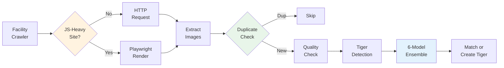
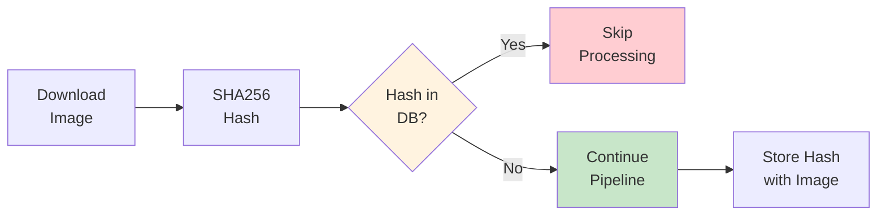
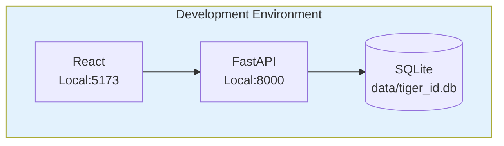
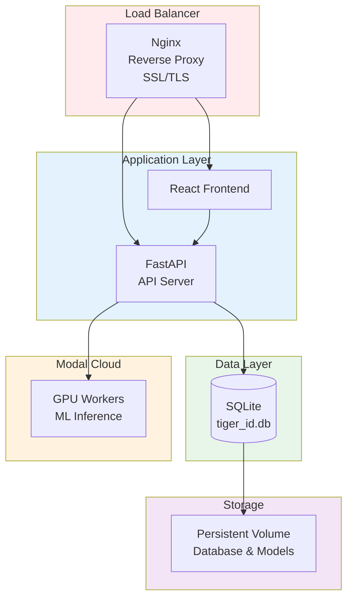

# System Architecture

## Table of Contents

- [Overview](#overview)
- [Architecture Diagram](#architecture-diagram)
- [Core Components](#core-components)
- [Data Flow](#data-flow)
- [Technology Stack](#technology-stack)
- [Deployment Architecture](#deployment-architecture)
- [Scalability Considerations](#scalability-considerations)
- [Security Architecture](#security-architecture)
- [Monitoring & Observability](#monitoring--observability)

## Overview

The Tiger Trafficking Investigation System is a comprehensive multi-agent investigative platform that combines AI orchestration, computer vision, web intelligence, and collaborative workflows to assist investigators in detecting and analyzing tiger trafficking activities.

## Architecture Diagram

```mermaid
graph TB
    subgraph Frontend["Frontend Layer"]
        UI[React Frontend]
        UI --> Home[Home Page]
        UI --> InvList[Investigations List]
        UI --> InvWorkspace[Investigation Workspace]
        UI --> InvTools[Investigation Tools]
        UI --> Tigers[Tigers]
        UI --> Facilities[Facilities]
        UI --> Dashboard[Dashboard]
        UI --> Search[Search]
        UI --> Verify[Verification Queue]
    end

    subgraph API["FastAPI Backend"]
        Auth["Authentication & Authorization<br/>JWT, RBAC, CSRF"]
        Agents[Multi-Agent Orchestration System]
        WebIntel[Web Intelligence Services]
        CVModels[Computer Vision Models]
        Services[Business Logic Services]
        Jobs[Background Jobs]
        
        Agents --> Orch[Orchestrator Agent]
        Agents --> Research[Research Agent]
        Agents --> Analysis[Analysis Agent]
        Agents --> Validate[Validation Agent]
        Agents --> Report[Reporting Agent]
    end

    subgraph Data["Data Layer"]
        SQLite[("SQLite<br/>sqlite-vec<br/>Embeddings<br/>Audit Logs")]
    end

    subgraph External["External Services"]
        USDA[USDA API]
        CITES[CITES API]
        USFWS[USFWS API]
        Firecrawl[Firecrawl API]
        YouTube[YouTube API]
        Meta[Meta/Facebook API]
    end

    UI -->|HTTP/REST API| Agents
    UI -->|SSE| Agents
    UI -->|WebSocket| Agents
    Agents --> Auth
    Agents --> WebIntel
    Agents --> CVModels
    Agents --> Services
    Agents --> Jobs
    Services --> SQLite
    WebIntel --> Firecrawl
    WebIntel --> YouTube
    WebIntel --> Meta
    Services --> USDA
    Services --> CITES
    Services --> USFWS
```

## Core Components

### 1. Frontend (React/TypeScript)

**Purpose:** User interface for investigators to interact with the system.

**Key Pages:**
- **Home**: Dashboard with activity feed and quick actions
- **Investigations**: List and manage investigations
- **Investigation Workspace**: Detailed investigation view with chat, timeline, relationships, and evidence
- **Investigation Tools**: Web search, image search, news monitoring, lead generation, etc.
- **Tigers**: Tiger identification and management
- **Facilities**: Facility information and monitoring
- **Dashboard**: Analytics and metrics visualization
- **Search**: Global search across all entities
- **Verification Queue**: Human-in-the-loop verification

**Technology Stack:**
- React 18+
- TypeScript
- Vite for build tooling
- Tailwind CSS for styling
- Recharts/Plotly for visualizations

### 2. Backend API (FastAPI)

**Purpose:** RESTful API providing all backend functionality.

**Key Features:**
- RESTful API design
- JWT authentication
- Server-Sent Events (SSE) for real-time updates
- Rate limiting (60 requests/minute per IP)
- CSRF protection (optional, via env var)
- Audit logging middleware
- CORS middleware
- Comprehensive error handling

**API Router Structure (16 route modules):**
- `/api/auth` - Authentication endpoints
- `/api/v1` - Core API endpoints  
- `/api/v1/investigations` - Investigation management and tools
- `/api/v1/search` - Global search
- `/api/v1/analytics` - Analytics endpoints
- `/api/v1/export` - Export functionality
- `/api/v1/audit` - Audit log endpoints (admin only)
- `/api/v1/notifications` - Notification endpoints
- `/api/v1/events` - Event history endpoints
- `/api/v1/sse` - Server-Sent Events for real-time updates
- `/api/v1/websocket` - WebSocket for real-time communication
- `/api/v1/verification` - Verification task endpoints
- `/api/v1/annotations` - Annotation endpoints
- `/api/v1/templates` - Template management
- `/api/v1/saved-searches` - Saved search management
- `/api/integrations` - External API integrations

### 3. Multi-Agent Orchestration System

**Purpose:** Coordinate specialized AI agents to perform comprehensive investigations.

**Agents:**

#### OrchestratorAgent
- Coordinates entire investigation workflow
- Manages agent execution sequence
- Emits events for real-time updates
- Handles error recovery and retries
- Integrates with NotificationService

#### ResearchAgent
- Gathers information from various sources
- Web search capabilities
- Reverse image search
- News monitoring
- Lead generation
- Reference facility checking
- Social media intelligence (YouTube, Meta/Facebook)
- Auto-links evidence to investigations

#### AnalysisAgent
- Analyzes collected evidence
- Detects contradictions
- Assesses trafficking probability
- Evidence strength evaluation

#### ValidationAgent
- Validates findings
- Detects hallucinations
- Cross-validates evidence
- Overall confidence assessment

#### ReportingAgent
- Compiles investigation reports
- Generates summaries
- Creates recommendations

**Agent Communication:**
- Event-driven architecture
- Shared database state
- Tool-based interaction via MCP (Model Context Protocol)
- Optional Langgraph StateGraph workflow (enabled via `USE_LANGGRAPH` env var)

**MCP Servers:**
- **FirecrawlMCPServer**: Web search and scraping tools
- **DatabaseMCPServer**: Database query tools
- **TigerIDMCPServer**: Tiger identification tools
- **YouTubeMCPServer**: YouTube Data API v3 tools (video search, channel info, comments)
- **MetaMCPServer**: Meta Graph API tools (page search, posts, comments)

**Workflow Orchestration:**

- **OrchestratorAgent**: Custom orchestrator pattern (default)
  - Sequential execution of investigation phases
  - Direct agent coordination
  - Built-in error handling and recovery

- **InvestigationWorkflow (Langgraph)**: Optional Langgraph StateGraph implementation
  - State-based workflow management
  - Conditional routing between phases
  - Graph-based execution with checkpoints
  - Enable via `USE_LANGGRAPH=true` environment variable

### 4. Web Intelligence Services

**Purpose:** Gather intelligence from web sources.

**Services:**
- **WebSearchService**: Multi-provider web search (Serper, Tavily, Perplexity)
- **ImageSearchService**: Reverse image search
- **NewsMonitoringService**: Automated news article monitoring
- **LeadGenerationService**: Discovery of suspicious listings/activities
- **RelationshipAnalysisService**: Entity relationship extraction and link analysis
- **EvidenceCompilationService**: Evidence extraction, scoring, and grouping
- **CrawlSchedulerService**: Configurable crawl scheduling
- **YouTubeClient**: YouTube Data API v3 integration for video and channel intelligence
- **MetaClient**: Meta Graph API integration for Facebook page and post intelligence

### 5. Continuous Tiger Discovery Pipeline

**Purpose:** Automatically discover and identify tigers from facility websites and web searches.

> **See also:** [Discovery Pipeline Documentation](./DISCOVERY_PIPELINE.md) for detailed deployment and configuration guidance.

**Components:**

#### FacilityCrawlerService (`backend/services/facility_crawler_service.py`)
- Crawls TPC reference facility websites for tiger images
- Uses DuckDuckGo for web research and image search (no API keys required)
- Automatic JS-heavy site detection with Playwright fallback

#### ImagePipelineService (`backend/services/image_pipeline_service.py`)
- Processes discovered images through the full identification pipeline
- SHA256 deduplication prevents redundant GPU processing
- Quality assessment via OpenCV before ML inference

**Discovery Flow:**

**Rate Limiting:**

The `RateLimiter` class provides per-domain request throttling:

| Setting | Value | Description |
|---------|-------|-------------|
| Base interval | 2 seconds | Minimum time between requests to same domain |
| Max backoff | 60 seconds | Maximum wait time after repeated errors |
| Backoff trigger | HTTP 429, 503, 520-524 | Status codes that increase backoff |
| Recovery rate | 0.9x multiplier | Gradual backoff reduction on success |

**JS-Heavy Site Detection:**

Sites are classified as JavaScript-heavy if they contain 2+ indicators:
- Framework markers: `react`, `angular`, `vue`, `__next_data__`, `ng-app`
- Lazy loading: `loading="lazy"`, `data-src=`, `lazyload`
- Hydration: `hydrate`, `createRoot`, `window.__NUXT__`

**Image Deduplication:**

### 6. Computer Vision Models

**Purpose:** Detect and identify tigers in images.

**Models:**
- **MegaDetector v5**: Wildlife detection model for cropping tigers
- **Tiger Re-ID Model**: Siamese network for stripe pattern matching
- **Vector Search**: sqlite-vec for similarity search

**Model Pipeline:**

### 6. Database Layer (SQLite + sqlite-vec)

**Purpose:** Persistent data storage with vector search capabilities.

**Key Tables:**
- `users` - User accounts and authentication
- `investigations` - Investigation records
- `investigation_steps` - Investigation workflow steps
- `evidence` - Evidence items linked to investigations
- `tigers` - Tiger records
- `tiger_images` - Tiger images with metadata
- `vec_embeddings` - Vector embeddings (virtual table)
- `facilities` - Facility information
- `crawl_history` - Web crawl history
- `notifications` - User notifications
- `audit_logs` - System audit trail
- `verification_queue` - Human verification queue

**Extensions:**
- `sqlite-vec` - Vector similarity search for embeddings
- WAL mode for concurrent read performance
- Various indexes for performance optimization

### 7. Background Jobs

**Purpose:** Asynchronous task processing.

**Implementation:**
- Modal serverless GPUs for ML inference
- Threading for non-blocking operations
- Async task runner for investigations

### 9. Security & Infrastructure

**Security Features:**
- JWT authentication
- CSRF protection (optional)
- Rate limiting
- Audit logging
- Password hashing (bcrypt)
- Input sanitization

**Infrastructure:**
- Connection pooling
- Query optimization hooks
- Slow query logging
- Error tracking (Sentry integration)
- Health check endpoints

## Data Flow

### Investigation Workflow

### Tiger Identification Workflow

### Real-time Updates

## Technology Stack

### Frontend
- **React** 18+ - Web application framework
- **TypeScript** - Type-safe JavaScript
- **Vite** - Build tooling and dev server
- **Tailwind CSS** - Utility-first CSS framework
- **Recharts/Plotly** - Interactive charts

### Backend
- **FastAPI** 0.109+ - API framework
- **SQLAlchemy** 2.0+ - ORM
- **sqlite-vec** - Vector similarity search

### AI/ML
- **PyTorch** - Deep learning framework
- **Transformers** - Pre-trained models
- **Claude** (Anthropic) - LLM orchestrator and report generation
- **MegaDetector v5** - Wildlife detection
- **6-Model ReID Ensemble** - Tiger Re-ID (wildlife_tools, cvwc2019, transreid, megadescriptor_b, tiger_reid, rapid_reid)

### Database
- **SQLite** - Primary database (embedded, no server required)
- **sqlite-vec** - Vector similarity search extension

### Protocols
- **MCP (Model Context Protocol)** - Tool integration
- **JWT** - Authentication tokens
- **SSE (Server-Sent Events)** - Real-time updates
- **Langgraph** - Optional workflow orchestration (enabled via USE_LANGGRAPH env var)

## Deployment Architecture

### Development

**Characteristics:**
- All services run locally
- SQLite database (no Docker required for database)
- Development mode with hot reloading
- Optional Docker for containerized deployment

### Production

**Characteristics:**
- Docker containers for API and frontend
- Reverse proxy (Nginx) for routing
- SSL/TLS encryption
- SQLite database with persistent volume
- Modal serverless GPUs for ML inference
- No external database server required

## Scalability Considerations

1. **API Scaling**: Multiple API instances behind load balancer
2. **ML Scaling**: Modal serverless GPU workers scale automatically
3. **Database Scaling**: Connection pooling, read replicas (future)
4. **Cache Scaling**: Redis cluster (future)
5. **Model Inference**: Batch processing, GPU allocation

## Security Architecture

**Key Security Features:**
1. **Authentication**: JWT tokens with expiration
2. **Authorization**: Role-based access control (RBAC)
3. **Input Validation**: Pydantic models, input sanitization
4. **CSRF Protection**: Token-based CSRF protection
5. **Rate Limiting**: Per-IP rate limiting
6. **Audit Logging**: Comprehensive audit trail
7. **Error Tracking**: Sentry integration for error monitoring
8. **Secure Storage**: Password hashing, encrypted tokens

## Monitoring & Observability

**Monitoring Components:**
1. **Health Checks**: `/api/health` endpoint
2. **Audit Logs**: All actions logged to `audit_logs` table
3. **Application Metrics**: System metrics table
4. **Error Tracking**: Sentry for error monitoring
5. **Slow Query Logging**: Database query performance tracking
6. **Event Tracking**: Investigation workflow events

